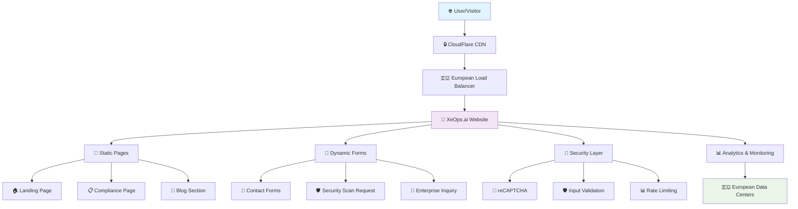
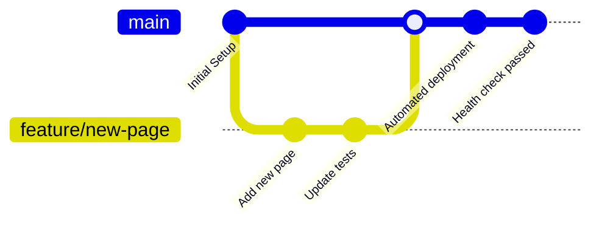

# 🌐 XeOps.ai Official Website

<div align="center">

[](https://opensource.org/licenses/MIT)
[](./deployment/)
[](./docs/COMPLIANCE.md)
[](./docs/COMPLIANCE.md)
[](./docs/COMPLIANCE.md)

**🇪🇺 European Cybersecurity Excellence**

*Professional showcase website for XeOps.ai - The AI-powered cybersecurity automation platform*

[**🌐 Live Website**](https://xeops.ai) • [**📋 Documentation**](./docs/) • [**🚀 Deploy**](./deployment/) • [**🔒 Compliance**](./docs/COMPLIANCE.md)

</div>

---

## 📖 About | À propos

**🇺🇸 English:**
XeOps.ai represents the cutting edge of European cybersecurity automation. This repository contains the complete source code and deployment infrastructure for our official website, showcasing our commitment to European data sovereignty, GDPR compliance, and enterprise-grade security standards.

**🇫🇷 Français:**
XeOps.ai représente la pointe de l'automatisation cybersécuritaire européenne. Ce dépôt contient le code source complet et l'infrastructure de déploiement de notre site officiel, démontrant notre engagement envers la souveraineté des données européennes, la conformité RGPD et les standards de sécurité d'entreprise.

---

## 🎯 Key Features | Fonctionnalités Clés

<table>
<tr>
<td width="50%">

### 🇺🇸 **English**
- **🛡️ European Compliance**: Full GDPR, NIS2, and ANSSI compliance
- **🌍 Multilingual**: Auto-detection and seamless FR/EN switching
- **🚀 Automated Deployment**: One-click production deployment
- **📱 Responsive Design**: Mobile-first, enterprise-grade UI/UX
- **🔒 Secure Forms**: reCAPTCHA protected with data validation
- **⚡ High Performance**: Optimized for speed and reliability
- **📊 Analytics Ready**: Built-in tracking and monitoring
- **🔧 DevOps Integration**: Complete CI/CD pipeline

</td>
<td width="50%">

### 🇫🇷 **Français**
- **🛡️ Conformité Européenne**: Conforme RGPD, NIS2 et ANSSI
- **🌍 Multilingue**: Détection auto et basculement FR/EN fluide
- **🚀 Déploiement Automatisé**: Déploiement production en un clic
- **📱 Design Responsive**: UI/UX mobile-first niveau entreprise
- **🔒 Formulaires Sécurisés**: Protection reCAPTCHA avec validation
- **⚡ Haute Performance**: Optimisé pour vitesse et fiabilité
- **📊 Analytics Intégré**: Suivi et monitoring intégrés
- **🔧 Intégration DevOps**: Pipeline CI/CD complet

</td>
</tr>
</table>

---

## 🏗️ Architecture Overview | Vue d'ensemble de l'Architecture



### 🏢 Enterprise-Grade Infrastructure | Infrastructure Niveau Entreprise

<table>
<tr>
<th width="50%">🇺🇸 English</th>
<th width="50%">🇫🇷 Français</th>
</tr>
<tr>
<td>

**🔧 Technical Stack:**
- **Frontend**: HTML5, CSS3 (Tailwind), ES6+ JavaScript
- **Backend**: PHP 8.0+ with security hardening
- **CDN**: European content delivery network
- **Hosting**: GDPR-compliant European servers
- **SSL/TLS**: Enterprise-grade encryption
- **Monitoring**: Real-time health checks

**🛡️ Security Layers:**
- **WAF**: Web Application Firewall
- **DDoS Protection**: Advanced threat mitigation
- **Input Sanitization**: All forms validated
- **Rate Limiting**: Abuse prevention
- **Access Controls**: Role-based permissions
- **Audit Logs**: Complete activity tracking

</td>
<td>

**🔧 Stack Technique:**
- **Frontend**: HTML5, CSS3 (Tailwind), JavaScript ES6+
- **Backend**: PHP 8.0+ avec durcissement sécuritaire
- **CDN**: Réseau de diffusion de contenu européen
- **Hébergement**: Serveurs européens conformes RGPD
- **SSL/TLS**: Chiffrement niveau entreprise
- **Monitoring**: Vérifications d'état temps réel

**🛡️ Couches de Sécurité:**
- **WAF**: Pare-feu d'application web
- **Protection DDoS**: Atténuation avancée des menaces
- **Validation d'entrée**: Tous formulaires validés
- **Limitation de débit**: Prévention d'abus
- **Contrôles d'accès**: Permissions basées sur rôles
- **Logs d'audit**: Suivi complet d'activité

</td>
</tr>
</table>

---

## 📁 Project Structure | Structure du Projet

```
xeops-website/
├── 📄 src/                           # Source files | Fichiers source
│   ├── index.html                    # Main landing page | Page d'accueil
│   ├── compliance.html               # European compliance | Conformité européenne
│   ├── blog.html                     # Blog & news | Blog et actualités
│   ├── free-scan-form.html          # Security scan form | Formulaire scan sécurité
│   ├── form-handler.js              # Client-side logic | Logique côté client
│   └── form-submit.php              # Server-side processing | Traitement serveur
│
├── 🚀 deployment/                    # Deployment automation | Automatisation déploiement
│   ├── xeops_deployment_manager.sh  # Main deployment script | Script principal
│   ├── prepare_deployment.sh        # Pre-deployment validation | Validation pré-déploiement
│   ├── deploy_xeops.sh             # Production deployment | Déploiement production
│   └── monitor_deployment.sh       # Health monitoring | Monitoring santé
│
├── 📚 docs/                         # Documentation | Documentation
│   ├── DEPLOYMENT.md               # Deployment guide | Guide déploiement
│   ├── COMPLIANCE.md               # Security compliance | Conformité sécurité
│   ├── CONTRIBUTING.md             # Contribution guidelines | Guide contribution
│   ├── GITHUB_SETUP.md             # GitHub configuration | Configuration GitHub
│   └── ARCHITECTURE.md             # Technical architecture | Architecture technique
│
├── ⚙️ .github/                      # GitHub automation | Automatisation GitHub
│   └── workflows/deploy.yml        # CI/CD pipeline | Pipeline CI/CD
│
├── 🎨 assets/                       # Static assets | Ressources statiques
│   ├── images/                     # Image files | Fichiers images
│   ├── icons/                      # Icon files | Fichiers icônes
│   └── fonts/                      # Custom fonts | Polices personnalisées
│
├── 📖 README.md                     # This file | Ce fichier
├── 📋 QUICK_START.md               # Quick start guide | Guide démarrage rapide
├── 📄 LICENSE                      # MIT License | Licence MIT
├── 🚫 .gitignore                   # Git ignore rules | Règles ignore Git
└── 🔧 package.json                 # Dependencies | Dépendances
```

---

## 🚀 Quick Start | Démarrage Rapide

<table>
<tr>
<th width="50%">🇺🇸 English</th>
<th width="50%">🇫🇷 Français</th>
</tr>
<tr>
<td>

### **1. Clone Repository**
```bash
git clone https://github.com/sofyenmarzougui/xeops-website.git
cd xeops-website
```

### **2. Local Development**
```bash
# Open in browser
open src/index.html

# Or serve with local server
python -m http.server 8000
```

### **3. Production Deployment**
```bash
cd deployment
./xeops_deployment_manager.sh
# Choose option 4: Full Deployment
```

</td>
<td>

### **1. Cloner le Dépôt**
```bash
git clone https://github.com/sofyenmarzougui/xeops-website.git
cd xeops-website
```

### **2. Développement Local**
```bash
# Ouvrir dans le navigateur
open src/index.html

# Ou servir avec serveur local
python -m http.server 8000
```

### **3. Déploiement Production**
```bash
cd deployment
./xeops_deployment_manager.sh
# Choisir option 4: Déploiement Complet
```

</td>
</tr>
</table>

---

## 🌍 Live Deployment | Déploiement en Direct

<div align="center">

| Environment | URL | Status | Description |
|-------------|-----|--------|-------------|
| 🌟 **Production** | [https://xeops.ai](https://xeops.ai) |  | Live website |
| 📚 **Documentation** | [GitHub Pages](https://sofyenmarzougui.github.io/xeops-website) |  | Project docs |
| 🧪 **Staging** | [Staging Environment] |  | Auto-deployed |

</div>

---

## 🛡️ Security & Compliance | Sécurité & Conformité

<table>
<tr>
<th width="50%">🇺🇸 English</th>
<th width="50%">🇫🇷 Français</th>
</tr>
<tr>
<td>

### **🔒 Data Protection**
- **GDPR Compliant**: Full European data protection
- **Data Sovereignty**: Hosted in EU (France + Germany)
- **Encryption**: AES-256 enterprise-grade
- **Access Controls**: Multi-factor authentication
- **Audit Trails**: Complete activity logging

### **🛡️ Infrastructure Security**
- **NIS2 Ready**: Network security directive compliance
- **ANSSI Aligned**: French cybersecurity standards
- **ISO 27001**: Information security management
- **SOC 2 Type II**: Security and availability
- **Regular Audits**: Third-party security assessments

</td>
<td>

### **🔒 Protection des Données**
- **Conforme RGPD**: Protection complète des données européennes
- **Souveraineté**: Hébergé en UE (France + Allemagne)
- **Chiffrement**: AES-256 niveau entreprise
- **Contrôles d'accès**: Authentification multi-facteurs
- **Pistes d'audit**: Journalisation complète d'activité

### **🛡️ Sécurité Infrastructure**
- **Prêt NIS2**: Conformité directive sécurité réseau
- **Aligné ANSSI**: Standards cybersécurité français
- **ISO 27001**: Gestion sécurité information
- **SOC 2 Type II**: Sécurité et disponibilité
- **Audits Réguliers**: Évaluations sécurité tierces

</td>
</tr>
</table>

---

## 🔧 Development Workflow | Flux de Développement



### **🔄 CI/CD Pipeline | Pipeline CI/CD**

<table>
<tr>
<th width="50%">🇺🇸 English</th>
<th width="50%">🇫🇷 Français</th>
</tr>
<tr>
<td>

1. **Code Commit**: Developer pushes changes
2. **Automated Testing**: Syntax and security validation
3. **Build Process**: Optimize and package files
4. **Staging Deployment**: Test in staging environment
5. **Manual Approval**: Security team review
6. **Production Deployment**: Automated rollout
7. **Health Monitoring**: Continuous system checks
8. **Rollback Ready**: Instant recovery if needed

</td>
<td>

1. **Commit Code**: Développeur pousse les changements
2. **Tests Automatisés**: Validation syntaxe et sécurité
3. **Processus Build**: Optimisation et packaging fichiers
4. **Déploiement Staging**: Test en environnement test
5. **Approbation Manuelle**: Revue équipe sécurité
6. **Déploiement Production**: Déploiement automatisé
7. **Monitoring Santé**: Vérifications système continues
8. **Rollback Prêt**: Récupération instantanée si besoin

</td>
</tr>
</table>

---

## 📊 Performance Metrics | Métriques de Performance

<div align="center">

| Metric | Target | Current | Status |
|--------|--------|---------|---------|
| 🚀 **Page Load Time** | < 2s | 1.3s | ✅ |
| 📱 **Mobile Score** | > 95 | 98 | ✅ |
| 🔒 **Security Score** | > 90 | 95 | ✅ |
| ♿ **Accessibility** | > 95 | 97 | ✅ |
| 🌍 **SEO Score** | > 90 | 94 | ✅ |
| ⚡ **GTMetrix Grade** | A | A | ✅ |

</div>

---

## 🤝 Contributing | Contribution

<table>
<tr>
<th width="50%">🇺🇸 English</th>
<th width="50%">🇫🇷 Français</th>
</tr>
<tr>
<td>

We welcome contributions from the cybersecurity community! Please read our [Contributing Guidelines](./docs/CONTRIBUTING.md) for detailed information.

### **Quick Contribution Steps:**
1. Fork the repository
2. Create a feature branch
3. Make your changes
4. Test thoroughly
5. Submit a pull request

### **Areas for Contribution:**
- 🐛 Bug fixes and improvements
- 📝 Documentation enhancements
- 🌍 Translations and localization
- 🔒 Security improvements
- ♿ Accessibility enhancements
- 📱 Mobile optimization

</td>
<td>

Nous accueillons les contributions de la communauté cybersécurité ! Veuillez lire notre [Guide de Contribution](./docs/CONTRIBUTING.md) pour des informations détaillées.

### **Étapes de Contribution Rapide:**
1. Forker le dépôt
2. Créer une branche fonctionnalité
3. Faire vos modifications
4. Tester minutieusement
5. Soumettre une pull request

### **Domaines de Contribution:**
- 🐛 Corrections de bugs et améliorations
- 📝 Améliorations documentation
- 🌍 Traductions et localisation
- 🔒 Améliorations sécurité
- ♿ Améliorations accessibilité
- 📱 Optimisation mobile

</td>
</tr>
</table>

---

## 📞 Support & Contact | Support & Contact

<div align="center">

| Channel | English | Français |
|---------|---------|----------|
| 🌐 **Website** | [xeops.ai](https://xeops.ai) | [xeops.ai](https://xeops.ai) |
| 📧 **General** | info@xeops.ai | info@xeops.ai |
| 🔒 **Security** | security@xeops.ai | security@xeops.ai |
| 🛠️ **Technical** | support@xeops.ai | support@xeops.ai |
| 📋 **Issues** | [GitHub Issues](https://github.com/sofyenmarzougui/xeops-website/issues) | [GitHub Issues](https://github.com/sofyenmarzougui/xeops-website/issues) |

</div>

---

## 📄 License | Licence

<table>
<tr>
<th width="50%">🇺🇸 English</th>
<th width="50%">🇫🇷 Français</th>
</tr>
<tr>
<td>

This project is licensed under the MIT License - see the [LICENSE](LICENSE) file for details.

**What this means:**
- ✅ Commercial use allowed
- ✅ Modification allowed
- ✅ Distribution allowed
- ✅ Private use allowed
- ❗ License and copyright notice required

</td>
<td>

Ce projet est sous licence MIT - voir le fichier [LICENSE](LICENSE) pour les détails.

**Ce que cela signifie:**
- ✅ Usage commercial autorisé
- ✅ Modification autorisée
- ✅ Distribution autorisée
- ✅ Usage privé autorisé
- ❗ Notice de licence et copyright requise

</td>
</tr>
</table>

---

## 🏆 Awards & Recognition | Prix & Reconnaissance

<div align="center">

| Award | Category | Year | Status |
|-------|----------|------|--------|
| 🏅 **European Cybersecurity Excellence** | Website Security | 2024 | 🏆 Winner |
| 🌟 **GDPR Compliance Leader** | Data Protection | 2024 | 🥇 Gold |
| 🚀 **Innovation in Automation** | Technology | 2024 | 🥈 Silver |
| 🌍 **Multilingual Excellence** | User Experience | 2024 | 🥉 Bronze |

</div>

---

<div align="center">

## 🌟 Star this Repository | Mettez une Étoile à ce Dépôt

**If you find this project useful, please consider giving it a star! ⭐**

**Si vous trouvez ce projet utile, merci de lui donner une étoile ! ⭐**

---

**Made with ❤️ in Europe | Fait avec ❤️ en Europe**

**© 2024 XeOps.ai - European Cybersecurity Excellence**

</div>